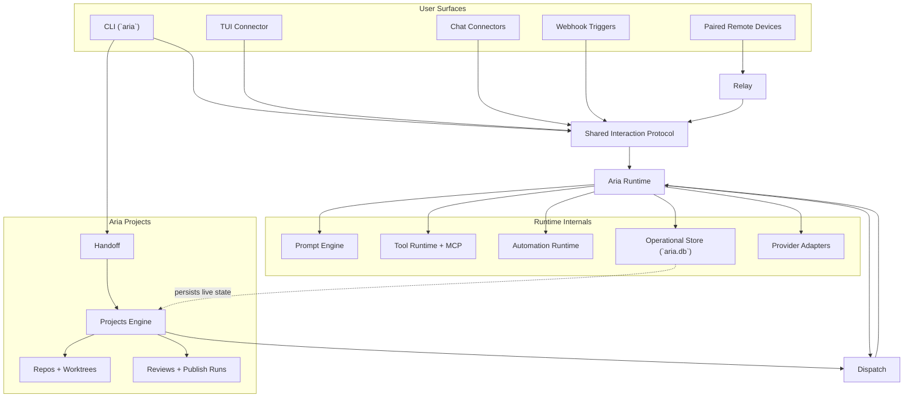

# Architecture

This section contains remaining current-state implementation notes while the repo continues moving to the target architecture.

`docs/new-architecture/*` is the source of truth for package boundaries, deployment model, and client/server responsibilities.

## Overall Diagram

- [runtime.md](./runtime.md)
- [storage-and-recovery.md](./storage-and-recovery.md)
- [tool-runtime.md](./tool-runtime.md)
- [handoff.md](./handoff.md)
- [providers.md](./providers.md)
- [interaction-protocol.md](./interaction-protocol.md)
