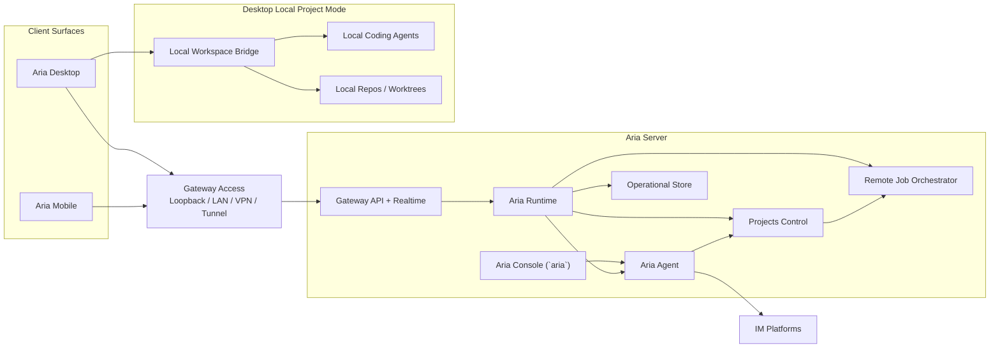

# Architecture Overview

The Aria architecture separates the system into one server-hosted assistant platform and multiple client surfaces.

The most important rule is simple:

`Aria Agent` runs only on `Aria Server`.

Everything else follows from that.

## Product Surfaces

| Surface        | Role                                                                                                  |
| -------------- | ----------------------------------------------------------------------------------------------------- |
| `Aria Server`  | Hosts `Aria Agent`, remote project jobs, IM connectors, automations, memory, audit, and durable state |
| `Aria Desktop` | Multi-surface client for Aria chat, remote projects, and local projects                               |
| `Aria Mobile`  | Thin client for Aria chat, inbox, automations, and remote projects                                    |
| `Aria Console` | Server-local terminal UI for chatting directly with `Aria Agent`                                      |

## Architectural Principles

1. `Aria Agent` is server-only.
2. Aria-managed memory, context, connectors, and automation are server-only.
3. `Aria Agent` can manage projects through an explicit project control plane.
4. Desktop local coding work is a separate execution plane from Aria-managed assistant state.
5. Remote jobs always run on `Aria Server`.
6. Clients stay thin relative to durable assistant state.
7. The same identity model should span chat, jobs, automation, approvals, and audit.
8. `Aria Server Gateway` is the secure assistant boundary; VPNs, tunnels, and reverse proxies are operator-managed infrastructure rather than Aria product surfaces.

## System Landscape

## Product Spaces

The desktop product should present three distinct spaces.

| Space                   | Hosted by                         | What lives there                                                                    |
| ----------------------- | --------------------------------- | ----------------------------------------------------------------------------------- |
| `Aria`                  | `Aria Server`                     | Aria chat, connector threads, automations, inbox, approvals                         |
| `Projects`              | `Aria Desktop` plus `Aria Server` | Unified project threads with environment switching between local and remote targets |
| `Local execution plane` | `Aria Desktop`                    | Local folders, local worktrees, local coding agents                                 |

This separation is not cosmetic. It enforces the correct ownership model.

## UI Direction

Desktop and mobile should use a shared interaction model:

- one unified project-thread sidebar
- a central conversation and run stream
- a contextual right-side pane for reviews, diffs, environment details, or task state
- mobile layouts that preserve the same thread model while collapsing secondary panels into sheets or stacked views

The right product split for Aria remains:

- `Aria`
- `Projects`

not a generic flat “sessions only” surface.

## Top-Level Responsibility Split

### `Aria Server`

- runs `Aria Agent`
- stores canonical Aria memory and context
- owns IM connectors
- owns automation
- owns project control for Aria-managed project workflows
- hosts remote project jobs
- stores durable run, thread, audit, and checkpoint state for server-hosted work

### `Aria Desktop`

- renders the primary operator UI
- provides the local project execution bridge
- runs local coding agents
- stores local project thread cache and local UI state
- connects to one or more Aria Servers for Aria and project management

### `Aria Mobile`

- renders mobile chat, inbox, approvals, and remote project surfaces
- never hosts `Aria Agent`
- never owns Aria-managed memory or automation
- never hosts local coding-agent execution

### Gateway access

- `Aria Server` always exposes its built-in `Gateway API + Realtime`
- operators decide whether that gateway is reachable over loopback, LAN, VPN, or a published tunnel/proxy
- external network infrastructure handles reachability, TLS termination, and routing
- assistant behavior, auth, approvals, and runtime state remain on `Aria Server`

## Hard Boundary Rules

The following rules are architectural, not optional UX choices.

### Server-only features

- `Aria Agent`
- Aria-managed memory and context
- skill management for Aria
- IM connectors
- heartbeat / cron / webhook automation
- project control for Aria-managed project workflows
- remote job orchestration
- server-hosted inbox and approvals

### Desktop-local features

- local filesystem access for local projects
- local git and local worktree management
- local coding-agent execution
- local project thread state

### Forbidden combinations

- no `Aria Agent` running on desktop or mobile
- no IM connectors bound directly to desktop-local coding threads
- no server-side Aria memory automatically shared with local coding threads
- no mobile-hosted coding agents

## North-Star User Experience

### Aria

The user can:

- chat with `Aria Agent`
- review inbox items
- manage automations
- view IM connector conversations
- manage projects through Aria
- approve or reject server-side actions

### Projects

The user can:

- open a project once in a unified sidebar
- keep project threads visible without splitting local and remote into separate trees
- switch the active execution environment in the thread view
- choose between local environments and remote environments
- let Aria create, monitor, and coordinate project work
- disconnect and reconnect without losing remote job state

## Recommended Reading

- [deployment.md](./deployment.md)
- [server.md](./server.md)
- [desktop-and-mobile.md](./desktop-and-mobile.md)
- [domain-model.md](./domain-model.md)
- [packages.md](./packages.md)
