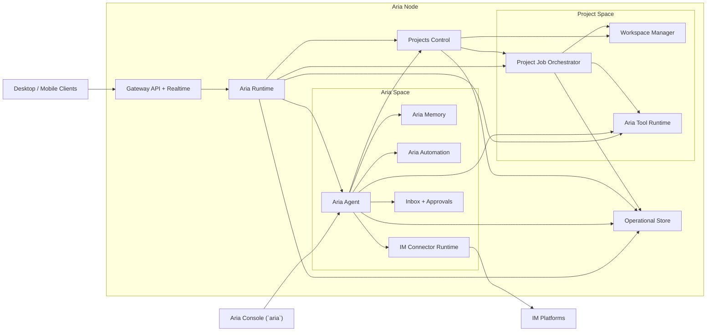

# Aria Node And Server

This page defines the internal component model of an `Aria Node`.

`Aria Server` is the headless deployment form of an Aria node. `Aria Desktop`
can also host a local Aria node on the current Mac. Both use the same runtime
and agent model.

## Node Component Diagram

## Component Responsibilities

| Component                  | Responsibility                                                                                                               |
| -------------------------- | ---------------------------------------------------------------------------------------------------------------------------- |
| `Gateway API + Realtime`   | Authenticates clients, issues pairing codes for local/admin enrollment, exposes request APIs, streams live thread/run events |
| `Aria Runtime`             | Shared runtime kernel for routing, persistence, policy, execution, and orchestration                                         |
| `Aria Agent`               | Personal assistant and coding agent; sole user-facing agent for Aria-managed work                                            |
| `Projects Control`         | Project registry, project-thread coordination, environment switching, and Aria-native execution routing                      |
| `Aria Memory`              | Memory layers, context assembly inputs, skills, and durable assistant knowledge                                              |
| `Aria Automation`          | Heartbeat, cron, and webhook automation owned by the node                                                                    |
| `IM Connector Runtime`     | Slack/Telegram/Discord/Teams style connector processes and adapter logic                                                     |
| `Inbox + Approvals`        | Pending approvals, notifications, operator action items, and result surfacing                                                |
| `Project Job Orchestrator` | Launches, tracks, cancels, and resumes project jobs executed by Aria                                                         |
| `Workspace Manager`        | Repos, worktrees, sandbox lifecycle, and environment selection                                                               |
| `Aria Harness`             | Agent-facing sessions, shell/file environments, roles, skills, tasks, command leases, and typed results                      |
| `Aria Tool Runtime`        | Native file, terminal, git, web, MCP, and coding tool execution under policy                                                 |
| `Operational Store`        | Durable threads, runs, approvals, automation state, audit, checkpoints, summaries                                            |

## Ownership Rules

Prompt assembly for `Aria Agent` and runtime-managed execution is defined in
[../runtime/prompt-engine.md](../runtime/prompt-engine.md).

### `Aria Agent` owns

- direct Aria conversations
- IM connector conversations
- Aria-managed memory and context
- skill loading for Aria
- heartbeat / cron / webhook definitions
- inbox items caused by Aria and automation
- project-management decisions and project execution through `Projects Control`
- coding task execution through native runtime tools

### `Projects Control` owns

- project registry and metadata
- project-thread registration
- active environment selection for project threads
- thread-to-environment reassignment history
- dispatch to local or remote Aria node execution targets
- Aria-managed project orchestration APIs

### `Project Job Orchestrator` owns

- project job lifecycle
- job resumability
- job cancellation
- environment allocation
- durable job status and event replay

### `Aria Runtime` owns

- protocol dispatch
- persistent thread/run bookkeeping
- cross-cutting policy enforcement
- approval routing
- audit hooks

### `Aria Harness` owns

- generated built-in agent tools from `AriaSessionEnv`
- default, host, and external shell environment routing
- harness-local session history, tasks, roles, skills, and typed result ergonomics
- command lease ergonomics without owning secret storage or approval decisions

## Critical Constraint

`Aria Agent` is the only user-facing agent allowed to use Aria memory,
automation, connectors, and coding tools.

External coding-agent delegation is not part of the runtime-managed project
execution model. Aria performs coding work through the same tool, policy,
approval, and audit surfaces used for normal assistant work.

## Primary Flows

### 1. Aria chat from desktop, mobile, or console

1. Client or `Aria Console` sends a message to the node
2. `Gateway API + Realtime` authenticates and routes the request
3. `Aria Runtime` resolves the target Aria thread
4. `Aria Runtime` invokes `Aria Agent`
5. `Aria Agent` reads memory, context, skills, and policy
6. streamed output is published back to the caller
7. durable state is written to `Operational Store`

### 2. IM connector message

1. connector event arrives at `IM Connector Runtime`
2. event is normalized into an Aria thread message
3. `Aria Agent` handles the message
4. the result is streamed back to the connector adapter
5. thread, run, and audit state are persisted

### 3. Automation run

1. `Aria Automation` trigger fires
2. `Aria Runtime` creates a task run
3. `Aria Agent` executes under automation policy
4. results are written to inbox and store
5. optional connector delivery is performed by the connector layer

### 4. Project thread

1. desktop or mobile opens a project thread
2. `Gateway API + Realtime` routes it to `Aria Runtime`
3. `Aria Runtime` resolves project state through `Projects Control`
4. `Projects Control` resolves the active node environment
5. `Projects Control` invokes `Project Job Orchestrator` when long-running work is needed
6. `Aria Agent` executes through native runtime tools in the selected environment
7. run state, tool state, and results are persisted to the store

### 5. Handoff between nodes

1. operator asks Aria to continue work on another node
2. `Projects Control` validates the target node and environment
3. handoff transfers state through Git branch, patch bundle, or an approved future mechanism
4. a durable thread/environment binding event is recorded
5. the target node continues the same thread identity

## Server-local Console

`Aria Console` is a node-local terminal surface.

It is not a second assistant runtime. It is not a project shell. It is a local
UI for talking to `Aria Agent` on the node.

Recommended behavior:

- it authenticates locally against the node
- it opens or resumes Aria threads
- it exposes inbox and automation inspection appropriate for Aria use
- it uses normal runtime and project-control APIs for project work

## Gateway Access Rule

An Aria node must be safe to reach through its built-in gateway without
depending on an Aria-operated network broker.

That implies:

- default bind should stay loopback-first unless the operator explicitly chooses LAN/public reachability
- pairing code generation is a local/admin action, not a public unauthenticated network action
- external tunnels, reverse proxies, and private overlays only publish the gateway; they do not take over authorization semantics
- the gateway remains the only authenticated API + realtime entrypoint

## Current Repo Note

The package names on this page are the live ownership boundaries. The main
remaining compatibility surface is the `@aria/runtime` shell.

## Recommended Internal Packages

| Responsibility                  | Package             |
| ------------------------------- | ------------------- |
| Node composition root           | `@aria/server`      |
| Runtime kernel                  | `@aria/runtime`     |
| Gateway API and realtime        | `@aria/gateway`     |
| Aria assistant and coding agent | `@aria/agent`       |
| Project control                 | `@aria/work`        |
| Memory and skills               | `@aria/memory`      |
| Automation                      | `@aria/automation`  |
| IM connectors                   | `@aria/connectors`  |
| Project jobs                    | `@aria/jobs`        |
| Workspace manager               | `@aria/workspaces`  |
| Durable persistence             | `@aria/persistence` |
| Audit services                  | `@aria/audit`       |
| Prompt assembly                 | `@aria/prompt`      |
| Agent harness                   | `@aria/harness`     |
| Tool compatibility exports      | `@aria/tools`       |
| Policy and approvals            | `@aria/policy`      |
| Node-local console              | `@aria/console`     |

## What Must Not Happen

- external coding agents must not be exposed as runtime project workers
- IM connectors must not attach directly to client-only thread state
- the gateway layer must not contain assistant business logic
- mobile must not host `Aria Agent` or project execution
