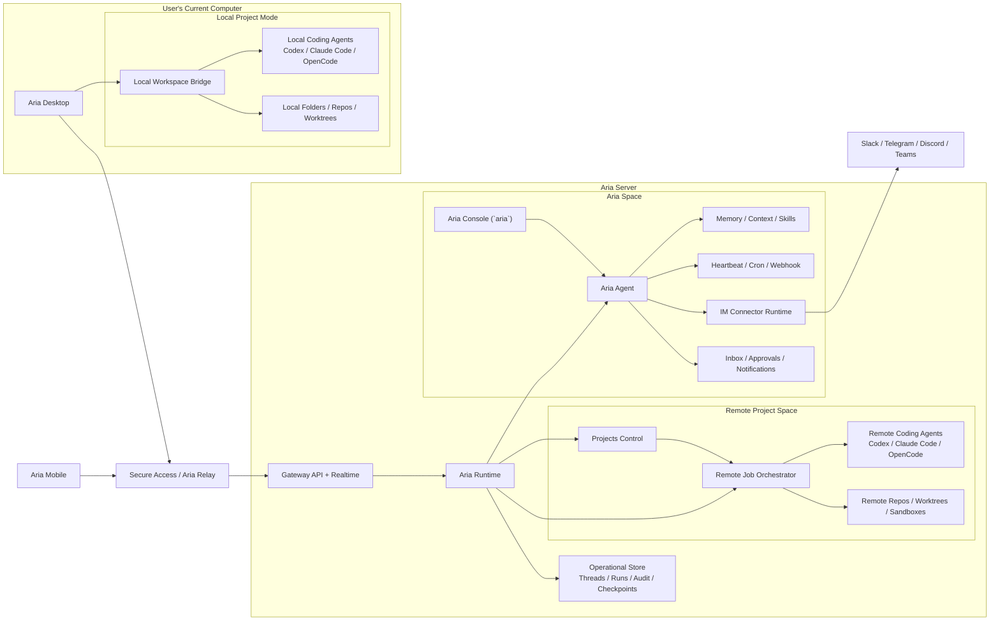

# Deployment Model

This page defines where each major component runs and how clients reach it.

## Deployment Diagram

## Supported Deployment Modes

### 1. Self-hosted home or office machine

The user runs `Aria Server` on a desktop workstation, Mac mini, or home machine.

- `Aria Agent` lives there
- IM connectors live there
- automation lives there
- remote coding jobs live there
- `Aria Desktop` and `Aria Mobile` connect in from elsewhere

This is the default self-hosted “personal server” model.

### 2. Cloud or server-hosted runtime

The user runs `Aria Server` on a VPS, bare-metal server, or managed host.

- same architecture as self-hosted
- better for always-on connectors and automation
- better for remote job availability

### 3. Desktop-local project mode

`Aria Desktop` can run local project work even when no local Aria server is present.

- only local coding agents run here
- no `Aria Agent`
- no Aria-managed memory
- no IM connectors
- no Aria automation
- no server-side project control authority

This mode is intentionally narrower than server mode.

## Placement Matrix

| Capability                                 | Desktop local  | Aria Server      | Mobile         | Relay |
| ------------------------------------------ | -------------- | ---------------- | -------------- | ----- |
| `Aria Agent`                               | no             | yes              | no             | no    |
| Aria-managed memory/context                | no             | yes              | no             | no    |
| IM connectors                              | no             | yes              | no             | no    |
| heartbeat / cron / webhook                 | no             | yes              | no             | no    |
| project control for Aria-managed workflows | no             | yes              | no             | no    |
| remote coding jobs                         | no             | yes              | no             | no    |
| local coding jobs                          | yes            | no               | no             | no    |
| local repo/worktree access                 | yes            | no               | no             | no    |
| Aria chat UI                               | yes, as client | yes, via console | yes, as client | no    |
| remote project UI                          | yes            | not primary      | yes            | no    |
| access brokering                           | no             | no               | no             | yes   |

## Connectivity Modes

### Direct secure connection

The client reaches `Aria Server` directly.

Typical examples:

- same LAN
- VPN
- Tailscale
- direct public endpoint with server auth

### Relay-assisted connection

The client reaches `Aria Server` through `Aria Relay`.

Use this when:

- the server is behind NAT
- the operator does not want to expose the server directly
- mobile access needs stable brokered connectivity

See [relay.md](./relay.md) for the detailed Relay design.

## Failure and Disconnect Model

### Local projects

- local desktop threads depend on the local machine
- if the desktop app closes, local background jobs may stop unless explicitly delegated to a local durable worker later

### Server-hosted Aria

- Aria chat, connectors, and automation continue while clients disconnect
- inbox state and approvals remain durable on the server

### Remote projects

- remote jobs continue on the server when a client disconnects
- client reconnection should reattach to thread and run state

## Security Boundary

The core security boundary is host ownership.

### Desktop local boundary

Desktop-local project work can touch local files and local coding agents, but it does not gain automatic access to server-side Aria memory or connectors.

If `Aria Agent` is allowed to manage a local project, it must do so through an explicit desktop bridge session and explicit project attachment.

### Server boundary

`Aria Server` owns:

- Aria memory
- connector tokens
- automation definitions
- remote workspace state
- remote job execution
- canonical server-hosted thread and run records

### Relay boundary

`Aria Relay` carries access and transport. It must not become the owner of Aria memory, automations, or assistant semantics.

## Naming Guidance

Deployment language should stay precise:

- say `Aria Server` when you mean the deployed server host
- say `Aria Runtime` when you mean the internal runtime kernel
- say `Aria Console` when you mean the server-local `aria` terminal UI
- say `Aria Desktop` when you mean the desktop client
- say `Aria Relay` when you mean the secure access broker
