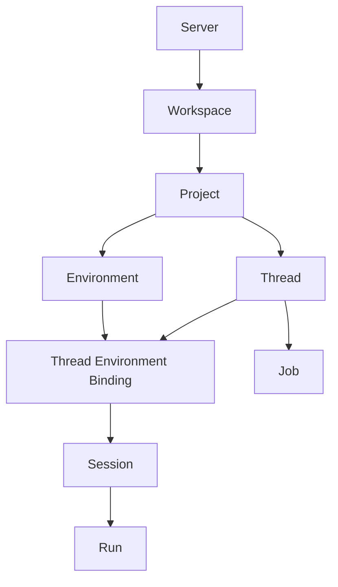

# Domain Model

This page defines the persistent and protocol-facing object model for the new architecture.

## Core Hierarchy

## Canonical Entities

| Entity                       | Meaning                                                                                    |
| ---------------------------- | ------------------------------------------------------------------------------------------ |
| `server`                     | An `Aria Server` deployment boundary                                                       |
| `workspace`                  | An execution boundary inside a server or desktop-local project plane                       |
| `project`                    | A repo, folder, or logical work unit inside a workspace                                    |
| `environment`                | A concrete execution target such as `main`, worktree, or sandbox                           |
| `thread`                     | A user-visible conversation or job surface                                                 |
| `thread_environment_binding` | The current or historical attachment between a project thread and an execution environment |
| `session`                    | Runtime continuity object backing a thread                                                 |
| `run`                        | One model/tool execution inside a session                                                  |
| `job`                        | A durable long-running execution owned by a thread                                         |
| `agent_adapter`              | The agent implementation assigned to a thread                                              |
| `automation`                 | A server-owned recurring or event-triggered job spec                                       |
| `memory_record`              | Durable assistant memory owned by `Aria Agent`                                             |
| `connector_account`          | A bound IM integration account                                                             |
| `approval`                   | Pending operator approval item                                                             |
| `audit_event`                | Durable security and action trail record                                                   |

## User-Facing vs Runtime Terms

| User-facing term    | Runtime term                   | Notes                                                                                        |
| ------------------- | ------------------------------ | -------------------------------------------------------------------------------------------- |
| Thread              | `thread` + `session`           | The user sees a thread, the runtime still needs session continuity                           |
| Active environment  | `thread_environment_binding`   | The UI can show an environment switch without making environments the primary sidebar object |
| Remote job          | `job` + `run`                  | Jobs may span many runs                                                                      |
| Project environment | `environment`                  | Includes main branch, worktree, or sandbox                                                   |
| Aria chat           | `thread` bound to `Aria Agent` | Server-hosted only                                                                           |

The UI should prefer `thread` over `session`.

## Ownership Matrix

| Entity                       | Desktop local    | Aria Server | Notes                                                                     |
| ---------------------------- | ---------------- | ----------- | ------------------------------------------------------------------------- |
| `server`                     | no               | yes         | Server boundary exists only for actual server deployments                 |
| `workspace`                  | yes              | yes         | Local project workspaces and server workspaces both exist                 |
| `project`                    | yes              | yes         | Project may be local or remote                                            |
| `environment`                | yes              | yes         | Local worktree or remote worktree                                         |
| `thread`                     | yes              | yes         | Local project threads on desktop, Aria/remote threads on server           |
| `thread_environment_binding` | yes              | yes         | Needed to support explicit environment switching                          |
| `session`                    | yes              | yes         | Runtime-internal continuity object                                        |
| `run`                        | yes              | yes         | Execution record                                                          |
| `job`                        | local optional   | yes         | Remote jobs must live on server                                           |
| `automation`                 | no               | yes         | Server-only                                                               |
| `memory_record`              | no               | yes         | Aria-managed memory is server-only                                        |
| `connector_account`          | no               | yes         | Server-only                                                               |
| `approval`                   | yes, as cache    | yes         | Canonical state for server-hosted work lives on server                    |
| `audit_event`                | local local-only | yes         | Local project mode may keep local audit; server owns canonical Aria audit |

## Thread Types

The system should model thread type explicitly.

| Thread type      | Agent                | Host           |
| ---------------- | -------------------- | -------------- |
| `aria`           | `Aria Agent`         | `Aria Server`  |
| `connector`      | `Aria Agent`         | `Aria Server`  |
| `automation`     | `Aria Agent`         | `Aria Server`  |
| `remote_project` | coding agent adapter | `Aria Server`  |
| `local_project`  | coding agent adapter | `Aria Desktop` |

## Agent Assignment

Every thread has exactly one primary agent adapter.

Examples:

- `aria` -> `aria-agent`
- `remote_project` -> `codex`, `claude-code`, or `opencode`
- `local_project` -> `codex`, `claude-code`, or `opencode`

This should be modeled directly rather than inferred from connector type.

## Project Management By Aria

`Aria Agent` can manage projects, but it should not own every project run directly.

Recommended split:

- `Aria Agent` owns project-management intent, planning, coordination, and summaries
- coding agent adapters own concrete local or remote implementation runs
- `Projects Control` owns thread/environment dispatch rules

This allows Aria to manage a project without collapsing the worker model.

## Recommended Identity Fields

Every persisted record and every streamed event should carry as much of this identity as is available:

- `serverId`
- `workspaceId`
- `projectId`
- `environmentId`
- `threadId`
- `sessionId`
- `runId`
- `jobId`
- `taskId`
- `agentId`
- `actorId`

## Event Correlation

### Minimum event identity

For server-hosted work:

- `serverId`
- `threadId`
- `sessionId`
- `runId`
- `agentId`

For remote project jobs:

- `serverId`
- `workspaceId`
- `projectId`
- `environmentId`
- `threadId`
- `jobId`
- `runId`
- `agentId`

For local project work:

- `threadId`
- `projectId`
- `environmentId`
- `runId`
- `agentId`

`@aria/protocol` should own the normalization and assembly of these streamed event envelopes so gateway/runtime code only supplies event payloads plus correlation metadata.

## Storage Recommendations

The new store shape should separate assistant state from project execution state without inventing separate storage systems for everything.

Recommended top-level logical groups:

- `servers`
- `workspaces`
- `projects`
- `environments`
- `threads`
- `thread_environment_bindings`
- `sessions`
- `runs`
- `jobs`
- `agent_adapters`
- `automations`
- `automation_runs`
- `memory_records`
- `connector_accounts`
- `approvals`
- `audit_events`
- `checkpoints`

## Isolation Rules

### Aria isolation

`Aria Agent` threads can use:

- Aria memory
- skills
- connectors
- automation

### Project isolation

Project threads can use:

- project-scoped files
- coding agent adapters
- local or remote environment execution

Project threads must not silently inherit Aria-managed memory. If Aria is involved, the handoff must be explicit.

## Environment Switching Rules

To support a unified project sidebar with environment switching in the thread view:

1. a project thread belongs to a `project`, not directly to an `environment`
2. the thread has one active `thread_environment_binding`
3. switching environments creates a durable binding event or new binding record
4. each run stores the concrete environment it used
5. the UI may present the switch inline without losing auditability

## Explicit Handoff

When local or remote project work needs Aria involvement, the client or runtime should create a deliberate handoff event or linked thread reference rather than blurring the boundaries between thread types.
