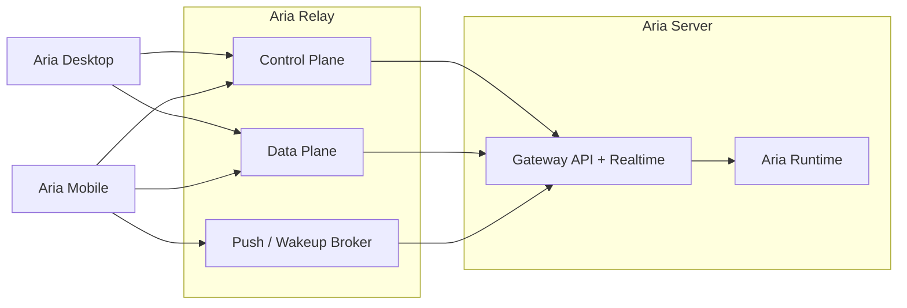

# Aria Relay

This page defines what `Aria Relay` does and how it should be designed.

## Purpose

`Aria Relay` is the secure access broker, tunnel, and session-routing layer for `Aria Server`.

It exists to make server-hosted Aria reachable from desktop and mobile clients when:

- the server is behind NAT
- direct inbound exposure is undesirable
- clients move across networks
- mobile devices need reconnect-friendly access

## Boundary

`Aria Relay` owns transport and access.

It does not own:

- `Aria Agent`
- Aria-managed memory
- connector execution
- automation semantics
- project orchestration semantics
- runtime state as a source of truth

Those remain on `Aria Server`.

## Relay Model

## What Relay Does

### Control plane

- server registration
- device and client enrollment
- reachability metadata
- direct-vs-relayed path selection
- attachment and presence metadata
- short-lived access grants

### Data plane

- websocket or realtime relay
- request tunneling when needed
- stream multiplexing
- attachment restoration on reconnect
- continuity for long-running remote jobs

### Push broker

- mobile wakeups for inbox and approvals
- reconnect nudges for active work
- lightweight notification delivery metadata

## What Relay Must Not Do

- no assistant reasoning
- no shadow runtime semantics
- no memory store for Aria
- no automation scheduler
- no connector logic
- no project-control source of truth

## Connection Strategy

Relay should preserve one Aria protocol regardless of path.

Preferred order:

1. direct secure connection to `Aria Server`
2. relay-assisted connection establishment
3. full relay tunnel through `Aria Relay`

Clients should continue speaking the same protocol in every case.

## Authentication And Trust

Recommended model:

### Server identity

Each `Aria Server` enrolls with Relay using a long-lived server identity credential or keypair.

### Client identity

Each desktop or mobile client authenticates as a user/device and receives short-lived relay access grants.

### Attachment scope

Relay grants should be narrowly scoped to:

- `serverId`
- client identity
- transport lifetime
- optional workspace or thread scope

The server remains the final authorization authority.

## Attachment Model

An attachment is the client’s active or resumable link to a server-hosted resource.

Examples:

- `Aria` chat
- remote project thread
- live remote job stream

Recommended properties:

- attachment IDs are short-lived but resumable
- reconnect can reclaim an attachment
- server-owned thread and run IDs remain canonical

## Self-Hosted Home-Desktop Use Case

Relay must support the case where the operator runs `Aria Server` on a home machine that only makes outbound connections.

That implies:

- outbound server registration
- outbound tunnel establishment
- no requirement for stable inbound public networking
- desktop and mobile clients can attach later from elsewhere

## Failure Model

### Relay failure

- direct-connected clients may still work
- server jobs continue
- server memory and automation remain intact

### Server failure

- Relay cannot replace the server
- clients may keep cached metadata only
- authoritative state remains unavailable until the server recovers

## Recommended Package

| Responsibility | Package       |
| -------------- | ------------- |
| Relay service  | `@aria/relay` |

Recommended internal slices:

- `@aria/relay/control`
- `@aria/relay/data`
- `@aria/relay/push`

## Summary

The short definition is:

`Aria Relay makes Aria Server reachable and reconnectable without taking over what Aria Server actually does.`

## Current Repo Migration Note

The relay service wrapper described here now exists on `new-aria`. The seam history is tracked in [../development/phase-13-relay-service-seam-ledger.md](../development/phase-13-relay-service-seam-ledger.md). `services/aria-relay` stays intentionally thin, while `@aria/relay` remains the underlying implementation owner by design.
