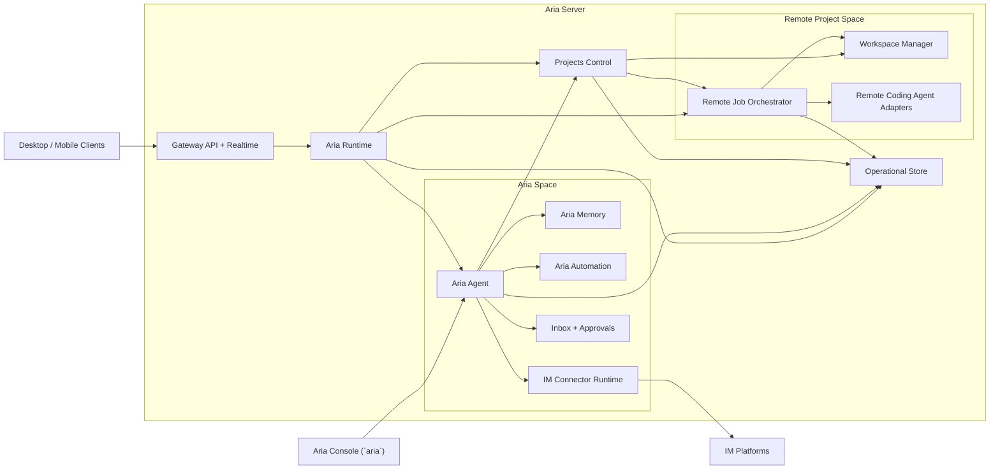

# Aria Server

This page defines the internal component model of `Aria Server`.

`Aria Server` is the canonical home of `Aria Agent` and every server-hosted capability.

## Server Component Diagram

## Component Responsibilities

| Component | Responsibility |
| --- | --- |
| `Gateway API + Realtime` | Authenticates clients, exposes request APIs, streams live thread/run events |
| `Aria Runtime` | Shared runtime kernel for routing, persistence, policy, execution, and orchestration |
| `Aria Agent` | Personal assistant agent and sole owner of Aria-managed memory, connectors, and automation |
| `Projects Control` | Project registry, project-thread coordination, environment switching, and Aria-to-coding-agent orchestration |
| `Aria Memory` | Memory layers, context assembly inputs, skills, and durable assistant knowledge |
| `Aria Automation` | Heartbeat, cron, and webhook automation owned by Aria |
| `IM Connector Runtime` | Slack/Telegram/Discord/Teams style connector processes and adapter logic |
| `Inbox + Approvals` | Pending approvals, notifications, operator action items, and result surfacing |
| `Remote Job Orchestrator` | Launches, tracks, and resumes remote project jobs |
| `Workspace Manager` | Remote repos, worktrees, sandbox lifecycle, and environment selection |
| `Remote Coding Agent Adapters` | Codex, Claude Code, OpenCode adapters for remote project execution |
| `Operational Store` | Durable threads, runs, approvals, automation state, audit, checkpoints, summaries |

## Ownership Rules

### `Aria Agent` owns

- direct Aria conversations
- IM connector conversations
- Aria-managed memory and context
- skill loading for Aria
- heartbeat / cron / webhook definitions
- inbox items caused by Aria and automation
- project-management decisions and orchestration through `Projects Control`

### `Projects Control` owns

- project registry and metadata
- project-thread registration
- active environment selection for project threads
- thread-to-environment reassignment history
- dispatch to local or remote execution targets
- Aria-managed project orchestration APIs

### `Remote Job Orchestrator` owns

- remote coding-agent thread execution
- remote job lifecycle
- job resumability
- job cancellation
- remote environment allocation

### `Aria Runtime` owns

- protocol dispatch
- persistent thread/run bookkeeping
- cross-cutting policy enforcement
- approval routing
- audit hooks

## Critical Constraint

`Aria Agent` is the only assistant allowed to use `Aria Memory`, `Aria Automation`, and `IM Connector Runtime`.

Remote coding agents do not talk to those subsystems directly.

That keeps the assistant boundary clean:

- Aria is the personal assistant
- coding agents are project workers

`Aria Agent` can still manage projects. It does so through `Projects Control`, not by collapsing coding-agent workers into the assistant itself.

## Primary Flows

### 1. Aria chat from desktop, mobile, or console

1. Client or `Aria Console` sends a message to the server
2. `Gateway API + Realtime` authenticates and routes the request
3. `Aria Runtime` resolves the target Aria thread
4. `Aria Runtime` invokes `Aria Agent`
5. `Aria Agent` reads memory, context, skills, and policy
6. streamed output is published back to the caller
7. durable state is written to `Operational Store`

### 2. IM connector message

1. connector event arrives at `IM Connector Runtime`
2. event is normalized into an Aria thread message
3. `Aria Agent` handles the message
4. the result is streamed back to the connector adapter
5. thread, run, and audit state are persisted

### 3. Automation run

1. `Aria Automation` trigger fires
2. `Aria Runtime` creates a task run
3. `Aria Agent` executes under automation policy
4. results are written to inbox and store
5. optional connector delivery is performed by the connector layer

### 4. Remote project thread

1. desktop or mobile opens a remote project thread
2. `Gateway API + Realtime` routes it to `Aria Runtime`
3. `Aria Runtime` resolves project state through `Projects Control`
4. `Projects Control` resolves the active environment
5. `Projects Control` invokes `Remote Job Orchestrator`
6. selected coding agent adapter executes in the remote environment
7. run state, tool state, and results are persisted to the store

### 5. Aria-managed project workflow

1. operator asks `Aria Agent` to manage a project
2. `Aria Agent` calls `Projects Control`
3. `Projects Control` resolves the project and available environments
4. Aria selects a local or remote target
5. if the target is remote, work is dispatched through `Remote Job Orchestrator`
6. if the target is local, work is dispatched through an explicitly attached desktop bridge session
7. Aria monitors status, summarizes results, and drives follow-up actions

## Server-local Console

`Aria Console` is a server-local terminal surface.

It is not a second assistant runtime. It is not a project shell. It is just a local UI for talking to `Aria Agent` on the server.

Recommended behavior:

- it authenticates locally against the server
- it opens or resumes Aria threads only
- it exposes inbox and automation inspection appropriate for Aria use
- it does not become a separate local-project environment

## Current Repo Migration Note

The target-state package names on this page are ahead of the current implementation. The migration status for the server-oriented seams `@aria/projects`, `@aria/workspaces`, `@aria/jobs`, and `@aria/agents-coding` is tracked in [../development/phase-4-server-package-seams-ledger.md](../development/phase-4-server-package-seams-ledger.md) while `@aria/projects-engine`, `@aria/runtime`, and `@aria/providers-*` remain the active compatibility surfaces.

## Recommended Internal Packages

| Responsibility | Package |
| --- | --- |
| Server app entrypoint | `@aria/server` |
| Runtime kernel | `@aria/runtime` |
| Gateway API and realtime | `@aria/gateway` |
| Aria assistant agent | `@aria/agent-aria` |
| Project control | `@aria/projects` |
| Memory and skills | `@aria/memory` |
| Automation | `@aria/automation` |
| IM connectors | `@aria/connectors-im` |
| Remote jobs | `@aria/jobs` |
| Workspace manager | `@aria/workspaces` |
| Coding agent adapters | `@aria/agents-coding` |
| Durable persistence | `@aria/store` |
| Audit services | `@aria/audit` |
| Prompt assembly | `@aria/prompt` |
| Tool runtime | `@aria/tools` |
| Policy and approvals | `@aria/policy` |
| Server-local console | `@aria/console` |

## What Must Not Happen

- `Aria Agent` must not run inside `Aria Desktop`
- IM connectors must not attach directly to local desktop coding threads
- remote coding agents must not own Aria memory or automation
- the gateway layer must not contain assistant business logic
