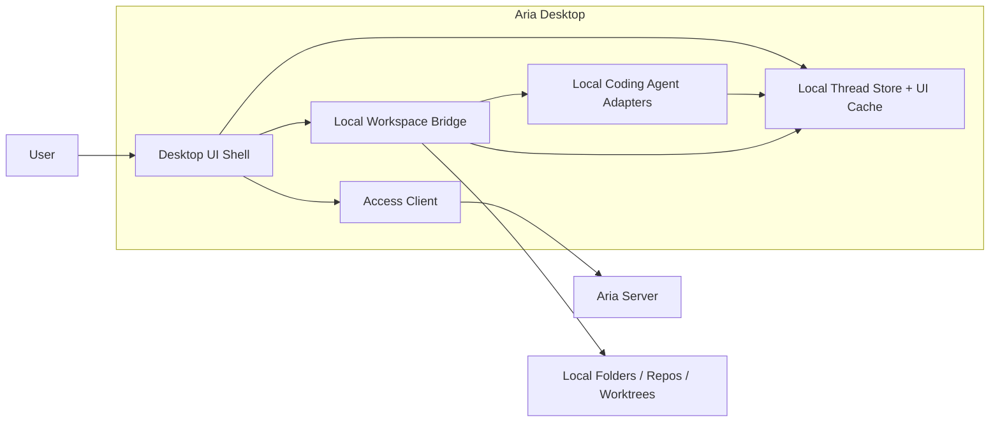
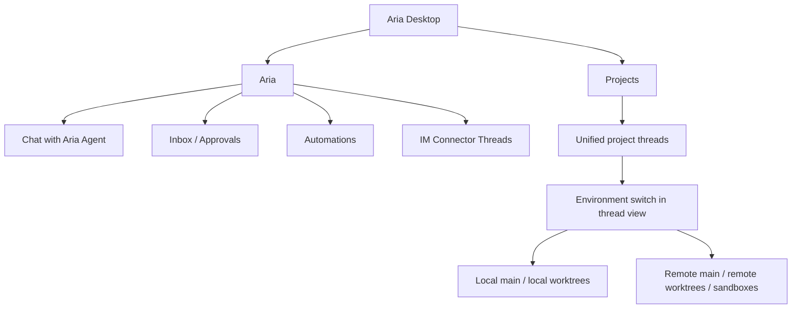
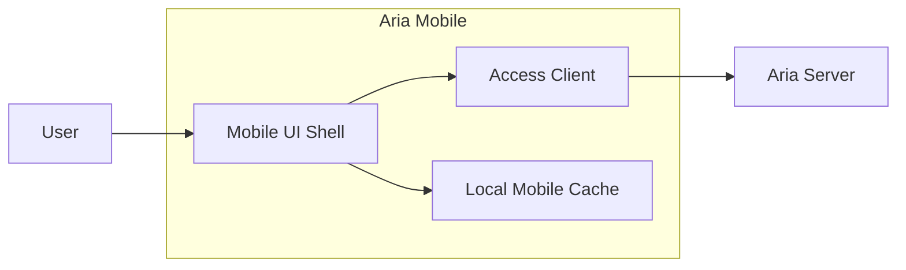

# Aria Desktop And Aria Mobile

This page defines the client-side architecture.

## Aria Desktop

`Aria Desktop` is the primary operator client. It has two fundamentally different execution modes:

- server-connected mode for `Aria` and project management
- local execution mode for local project environments

## Recommended Client Toolchain

Aria should standardize the client and shared-package toolchain on the broader VoidZero stack while using `Vite+` for monorepo management and `bun` as the selected package manager/runtime where supported.

Recommended baseline:

- `bun` as selected package manager/runtime under Vite+
- `Vite+` where a unified client/web toolchain is applicable
- `Vite` for dev-server and ecosystem compatibility
- `Rolldown` for builds and packaging
- `Oxc` for linting, formatting, and related language tooling
- `Vitest` for tests

This gives Aria:

- one coherent client and shared-package toolchain
- fast local development and CI
- good monorepo ergonomics
- strong support for AI-assisted workflows

For the concrete shell decisions, see [tech-decisions.md](./tech-decisions.md).

## Desktop Component Diagram



## Desktop Responsibilities

| Component | Responsibility |
| --- | --- |
| `Desktop UI Shell` | Sidebar, thread views, project pickers, environment selection, approvals UI |
| `Access Client` | Connects to one or more `Aria Server` deployments directly or through relay |
| `Local Workspace Bridge` | Local filesystem, git, worktree, shell, and environment integration |
| `Local Coding Agent Adapters` | Codex, Claude Code, OpenCode on the current machine |
| `Local Thread Store + UI Cache` | Local project thread state, UI cache, local run history, server metadata cache |

## Desktop Shell Recommendation

Recommended direction:

- React-based desktop UI
- `bun` for package management/runtime through Vite+
- VoidZero-stack toolchain for the renderer and shared UI packages
- desktop-native wrapper chosen separately from the renderer toolchain

The key architectural decision is the toolchain and package boundary, not a specific desktop wrapper first.

## Desktop Layout Model

Aria Desktop should use a three-pane productivity layout:

1. left sidebar for global navigation plus project/thread selection
2. center pane for the active thread stream
3. right-side contextual pane for review, changes, environment details, or task state
4. persistent bottom composer tied to the active thread

Recommended Aria layout:

```text
+---------------------------------------------------------------+
| Sidebar           | Active Thread                | Context    |
|                   |                              | Panel      |
| Aria              | header                       |            |
| Projects          |   thread title               | Review     |
|   Project A       |   environment switch         | Changes    |
|   Project B       |                              | Job State  |
|                   | stream                       | Artifacts  |
|                   |                              |            |
|                   | composer                     |            |
+---------------------------------------------------------------+
```

This layout fits both Aria comments you raised:

- the sidebar does not split local and remote projects
- the environment switch lives in the active thread area, not in the tree

## Desktop Product Spaces



## Desktop Sidebar Model

The left sidebar should not force a local-vs-remote split for project threads.

Instead:

- keep `Aria` as its own top-level space
- keep `Projects` as one unified top-level space
- let each project thread choose its execution environment in the right-side thread view

The execution target is an environment property, not the primary sidebar grouping.

Recommended hierarchy:

```text
Aria
  Chat
  Inbox
  Automations
  Connectors

Projects
  <Project A>
    <Thread 1>
    <Thread 2>
  <Project B>
    <Thread 1>
    <Thread 2>
```

In the thread header or right-side chat area, the user should see an environment selector such as:

```text
Environment:
  This Device / main
  This Device / wt/feature-x
  Home Server / main
  Home Server / wt/fix-login
  Cloud Server / sandbox/pr-128
```

The context pane should also surface:

- current environment metadata
- active agent
- job status
- review findings or diffs
- approvals or actions related to the current thread

## Desktop Thread Rules

### Aria threads

- always live on an `Aria Server`
- always talk to `Aria Agent`
- can access Aria-managed memory and automation

### Remote project threads

- are project threads currently attached to a remote environment
- execute through remote coding agent adapters
- can continue running when the desktop disconnects

### Local project threads

- are project threads currently attached to a local environment
- use local coding agents
- do not automatically share Aria-managed memory

### Unified project threads

A project thread may move between environments over time, but that move should be explicit and recorded.

Recommended rule:

- the thread has one active environment attachment at a time
- changing the environment is a tracked event
- runs record the exact environment they executed against
- Aria can request or perform this switch through `Projects Control`

Recommended UX rule:

- preserve one thread identity while switching execution targets when the user is continuing the same unit of work
- prompt before switching when the environment change is materially risky, such as moving from local main to a remote sandbox or vice versa

## Aria Mobile

`Aria Mobile` is a thin server client.

It should not host local project execution or local coding-agent subprocesses.

## Mobile Component Diagram



## Mobile Responsibilities

- chat with `Aria Agent`
- review inbox items
- answer approvals and questions
- inspect automation state
- view project threads that are attached to remote environments
- reconnect to ongoing remote jobs

## Mobile Layout Model

Mobile should preserve the same conceptual structure as desktop, but collapse panels into stacked views and sheets.

Recommended model:

1. top-level tabs or navigation for `Aria` and `Projects`
2. thread list screen
3. active thread screen with:
   - thread header
   - environment switch
   - message/run stream
   - composer
4. review/details presented as:
   - bottom sheet
   - push screen
   - segmented detail view

That keeps the thread model consistent across devices.

## Mobile Non-responsibilities

- no local coding agent execution
- no local repo or worktree management
- no Aria memory ownership
- no connector hosting
- no automation hosting

## Mobile Shell Recommendation

Mobile may need a native-oriented shell, but the monorepo should still use the same underlying client-tooling philosophy:

- bun at the repo/runtime layer where supported
- Oxc and Vitest across shared packages
- Rolldown-friendly package outputs for shared libraries where appropriate
- shared client contracts and UI packages with desktop as much as possible

## Client Access Layer

Both desktop and mobile should share the same access model:

- direct connection to `Aria Server`
- optional relay-assisted connection through `Aria Relay`
- support for multiple servers in one client
- a stable `serverId` as the root identity boundary

## Recommended Internal Packages

Current repo migration note: the thin seam wave for `@aria/access-client`, `@aria/ui`, `apps/aria-desktop`, and `apps/aria-mobile` is tracked in [../development/phase-6-client-app-seams-ledger.md](../development/phase-6-client-app-seams-ledger.md). Those seams are compatibility-first wrappers; the full desktop/mobile shells remain future work.

| Responsibility | Package |
| --- | --- |
| Desktop shell | `@aria/desktop` |
| Mobile shell | `@aria/mobile` |
| Shared access client | `@aria/access-client` |
| Shared project client state | `@aria/projects` or a dedicated client-facing slice of it |
| Desktop local bridge | `@aria/desktop-bridge` |
| Local git integration | `@aria/desktop-git` |
| Local coding agent adapters | `@aria/agents-coding` or `@aria/desktop-agents` |
| Shared UI primitives | `@aria/ui` |

## Current Repo Migration Note

The target-state package names on this page are ahead of the current implementation. The current client shared-seam wave for `@aria/access-client`, `@aria/ui`, `apps/aria-desktop`, and `apps/aria-mobile` is tracked in [../development/phase-6-client-app-seams-ledger.md](../development/phase-6-client-app-seams-ledger.md), the follow-on client shell-package wave for `@aria/desktop` and `@aria/mobile` is tracked in [../development/phase-8-client-shell-seams-ledger.md](../development/phase-8-client-shell-seams-ledger.md), and the server/runtime/project compatibility surfaces remain active behind `@aria/runtime`, `@aria/gateway`, `@aria/projects`, and the current console/CLI flows.

## Toolchain References

Official references:

- [Vite+](https://viteplus.dev/)
- [VoidZero](https://voidzero.dev/)

The VoidZero site describes Vite+ as the entry point that manages runtime, package manager, and frontend tooling, and positions Vite, Rolldown, Oxc, and Vitest as part of the same tooling family. Aria should adopt that toolchain direction while explicitly selecting `bun` as the package manager/runtime choice.

## Boundary Reminder

The desktop client can be powerful without becoming a second server.

That means:

- desktop can run local project workers
- desktop can render server-hosted Aria
- desktop must not become the host of `Aria Agent`

It can still let `Aria Agent` manage projects, but only through:

- explicit project attachment
- explicit environment selection
- explicit desktop bridge access for local environments
